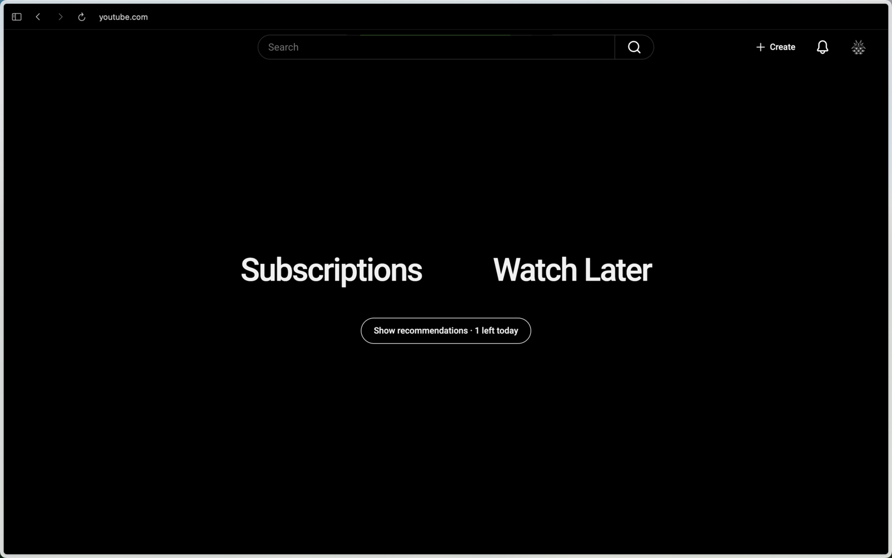

[English](#english) · [Русский](#русский)

# English

## I Fixed YouTube

A focused YouTube extension for Chrome and Chromium-based browsers.

### Features

- Minimal home screen with **Subscriptions** and **Watch Later**.
- Optional recommendations, available twice a day and limited to regular videos.
- Recommendation feeds exclude Shorts shelves, Playables, ads, Mixes, membership promos, and other inserted modules.
- Native search, Create, notifications, and account controls remain available; other navigation is hidden.
- Four-column Subscriptions grid without **Most relevant**.
- Fully watched subscription videos are 80% transparent.
- Circular one-click **Add to Watch Later** button in the video preview.
- Centered Watch Later list with one-click removal.
- Instant CSS-only search filtering: relevant videos, channels, and playlists render without JavaScript rescanning; ads and inserted recommendation modules stay hidden.
- Watch pages keep the player and description, hide side recommendations, and provide a small **Show comments** button. Comments stay open only for the current video until navigation or reload.
- Native YouTube light/dark theme support.
- Red cross extension icon; YouTube keeps its original site favicon.

### Download and install

1. Open the [latest release](https://github.com/mxmlsn/ifixedyoutube/releases/latest).
2. Under **Assets**, download **`ifixedyoutube.zip`**. Do not download the automatically generated “Source code” archives.
3. Unzip `ifixedyoutube.zip` into a permanent folder.
4. Open `chrome://extensions` in Chrome, Edge, Brave, Arc, or another Chromium browser.
5. Enable **Developer mode**.
6. Click **Load unpacked** and select the unzipped folder containing `manifest.json`.
7. Refresh any open YouTube tabs.

To update, download the newest `ifixedyoutube.zip`, replace the old files, then click **Reload** on the extension page.

---

# Русский

## I Fixed YouTube

Минималистичное расширение YouTube для Chrome и других Chromium-браузеров.

### Возможности

- Чистая главная страница с кнопками **Subscriptions** и **Watch Later**.
- Рекомендации доступны два раза в сутки и содержат только обычные видео.
- Из рекомендаций убраны блоки Shorts, Playables, реклама, Mix, предложения членства и другие вставные модули.
- Остаются нативные поиск, Create, уведомления и аккаунт; остальная навигация скрыта.
- Подписки в четыре колонки, без блока **Most relevant**.
- Полностью просмотренные видео в подписках отображаются с прозрачностью 80%.
- Круглая кнопка добавления в **Watch Later** прямо в preview видео.
- Отцентрированный список Watch Later с быстрым удалением.
- Мгновенный CSS-фильтр поиска: видео, каналы и плейлисты по запросу отображаются без повторных JavaScript-обходов, а реклама и вставные рекомендации скрываются.
- На странице просмотра остаются плеер и описание, боковые рекомендации скрыты. Небольшая кнопка **Show comments** временно открывает комментарии только для текущего видео — до перехода или перезагрузки.
- Нативная поддержка светлой и тёмной темы YouTube.
- Красный крест используется только как иконка расширения; фавикон сайта YouTube не меняется.

### Скачивание и установка

1. Откройте [последний релиз](https://github.com/mxmlsn/ifixedyoutube/releases/latest).
2. В разделе **Assets** скачайте именно **`ifixedyoutube.zip`**. Автоматические архивы “Source code” скачивать не нужно.
3. Распакуйте `ifixedyoutube.zip` в постоянную папку.
4. Откройте `chrome://extensions` в Chrome, Edge, Brave, Arc или другом Chromium-браузере.
5. Включите **Режим разработчика** / **Developer mode**.
6. Нажмите **Загрузить распакованное расширение** / **Load unpacked** и выберите распакованную папку, в которой находится `manifest.json`.
7. Обновите открытые вкладки YouTube.

Для обновления скачайте новый `ifixedyoutube.zip`, замените старые файлы и нажмите **Перезагрузить** / **Reload** на странице расширений.
