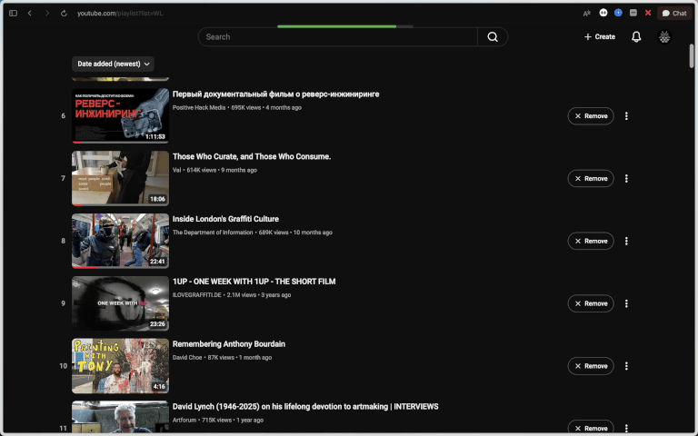

plz ignore green progress bar

[English](#english) · [Русский](#русский)

# English

## I Fixed YouTube

A distraction-free YouTube extension for Chromium browsers.

### Features

- Minimal home with **Subscriptions** and **Watch Later**.
- Optional recommendations twice a day, with regular videos only.
- No Shorts shelves, Playables, ads, Mixes, or membership promos.
- Four-column Subscriptions grid without **Most relevant**.
- Watched subscription videos are 80% transparent.
- One-click **Add to Watch Later** from video previews.
- Centered Watch Later list with one-click removal.
- Player and description without side recommendations; comments open on demand for the current video.
- Native light and dark themes.

### Download and install

1. Open the [latest release](https://github.com/mxmlsn/ifixedyoutube/releases/latest).
2. Under **Assets**, download **`ifixedyoutube.zip`**. Do not download the automatically generated “Source code” archives.
3. Unzip `ifixedyoutube.zip` into a permanent folder.
4. Open `chrome://extensions` in Chrome, Edge, Brave, Arc, or another Chromium browser.
5. Enable **Developer mode**.
6. Click **Load unpacked** and select the unzipped folder containing `manifest.json`.
7. Refresh any open YouTube tabs.

To update, download the newest `ifixedyoutube.zip`, replace the old files, then click **Reload** on the extension page.

---

# Русский

## I Fixed YouTube

YouTube без лишнего для Chrome и других Chromium-браузеров.

### Возможности

- Главная страница только с **Subscriptions** и **Watch Later**.
- Рекомендации два раза в сутки, только обычные видео.
- Без блоков Shorts, Playables, рекламы, Mix и предложений членства.
- Подписки в четыре колонки, без блока **Most relevant**.
- Просмотренные видео в подписках прозрачны на 80%.
- Добавление в **Watch Later** одним кликом из preview.
- Отцентрированный список Watch Later с быстрым удалением.
- Плеер и описание без боковых рекомендаций; комментарии открываются по кнопке для текущего видео.
- Нативная светлая и тёмная темы.

### Скачивание и установка

1. Откройте [последний релиз](https://github.com/mxmlsn/ifixedyoutube/releases/latest).
2. В разделе **Assets** скачайте именно **`ifixedyoutube.zip`**. Автоматические архивы “Source code” скачивать не нужно.
3. Распакуйте `ifixedyoutube.zip` в постоянную папку.
4. Откройте `chrome://extensions` в Chrome, Edge, Brave, Arc или другом Chromium-браузере.
5. Включите **Режим разработчика** / **Developer mode**.
6. Нажмите **Загрузить распакованное расширение** / **Load unpacked** и выберите распакованную папку, в которой находится `manifest.json`.
7. Обновите открытые вкладки YouTube.

Для обновления скачайте новый `ifixedyoutube.zip`, замените старые файлы и нажмите **Перезагрузить** / **Reload** на странице расширений.
